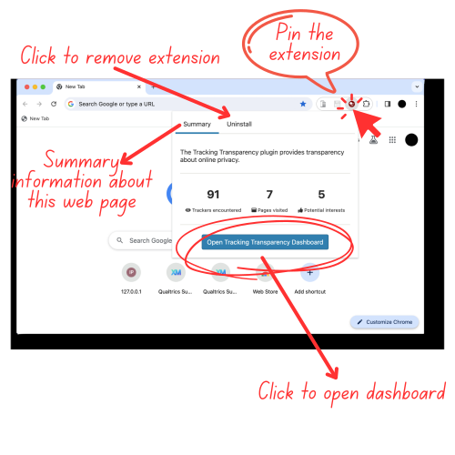
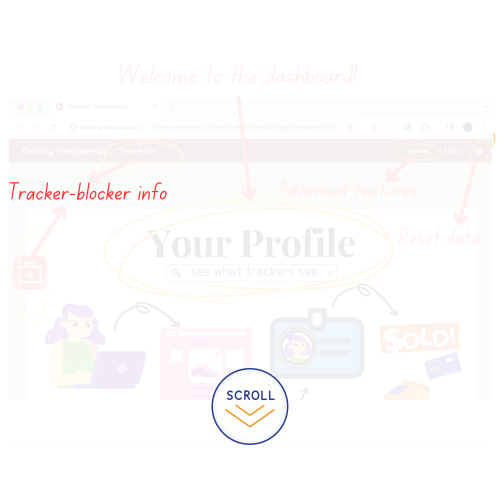

# Tracking Transparency

<p align="center"></p>

# About

A browser extension to provide transparency about online tracking. Unlike other privacy-focused tools (e.g., tracker blockers or ad blockers) the Tracking Transparency extension observes the activities of trackers and reports them back to you—using **machine learning** and other sophisticated techniques to provide you with a **Tracker's Perspective** of your online habits. 

<a href="https://osf.io/45kgc/">
  </a><a href="https://chromewebstore.google.com/detail/tracking-transparency/jeoddidpffcjecfojbjpjnjnbjeenhai"></a>

# Papers 

The Tracking Transaprency extension has played a primary role in the following papers: 

| Title                                                        | Venue | Year |
| ------------------------------------------------------------ | ----- | ---- |
| Oh, the Places You’ve Been! User Reactions to Longitudinal Transparency About Third-Party Web Tracking and Inferencing ([link](https://doi.org/10.1145/3319535.3363200)) | CCS   | 2019 |
| Analysis of Google Ads Settings Over Time: Updated, Individualized, Accurate, and Filtered ([link](https://doi.org/10.1145/3603216.3624968)) | WPES  | 2023 |
| What Does It Mean to Be Creepy? Responses to Visualizations of Personal Browsing Activity, Online Tracking, and Targeted Ads (link pending) | PETS  | 2024 |

# Table of Contents

<!-- TOC start -->

- [Install](#install)
  + [Add the Extension (Chrome)](#add-the-extension--chrome-)
  + [Other browsers](#other-browsers)
    - [Opera](#opera)
    - [Brave](#brave)
    - [Firefox (under development!)](#firefox--under-development--)
- [Building for Production](#building-for-production)
- [Dashboard](#dashboard)
- [Architecture](#architecture)
- [Database structure](#database-structure)
  * [Example data](#example-data)
- [Developing](#developing)
  * [A sample edit](#a-sample-edit)
  * [Sample tasks](#sample-tasks)

<!-- TOC end -->

---


> :warning: **Apple silicone**: Apple silicone affects the extension in Chrome, we are working on a patch! You should still be able to build and run the repo as a developer, but interacting with the extension in Chrome using Apple silicone might be slow.
>
> :warning: **MANIFEST V2**: This extension operates on manifest v2; Google is set to restrict extensions to manifest v3 in June 2024.
>
> :warning: **Older Packages**: Some of the NPM packages in this repo are outdated. These packages were necessary for the first iteration of this extension. Please remove them if you are developing a new version of the extension!

---


# Install

1. **Clone the repo!** 

```bash
git clone https://github.com/UChicagoSUPERgroup/TrackingTransparencyPETS2024.git
cd TrackingTransparencyPETS2024
```


2. **use the correct *node* (14.17.2) and *npm* (6.14.13) and *python* (tested on 3.7.12)**

```bash
node at 14.17.2 >> alternatively node at v18.16.0
npm at 6.14.13 >>> alternatively npm at 9.5.1
~~~~ TESTED ON Python 3.7.12 and 3.11.0 ~~~~ 
```

- **macOS**
  - get nvm using homebrew (https://tecadmin.net/install-nvm-macos-with-homebrew/)
    - `nvm install 14.17.2`
    - `nvm use 14.17.2`
    - `node -v` to confirm 
  - set npm
    - `npm install npm@6.14.13 -g`
    - `npm -v` to confirm `6.14.13`
- **Ubuntu**
  -  get nvm (https://tecadmin.net/how-to-install-nvm-on-ubuntu-20-04/) (tested on Ubuntu 22.04 LTS)
    - `nvm install 14.17.2`
    - `nvm use 14.17.2`
    - `node -v` to confirm 
  - set npm
    - `npm install npm@6.14.13 -g`
    - `npm -v` to confirm `6.14.13`
- **Windows**
  - get nvm (https://github.com/coreybutler/nvm-windows)
    - `nvm install 14.17.2`
    - `nvm use 14.17.2`
    - `node -v` to confirm 
  - set npm 
    - `npm install npm@6.14.13` 
    - `npm -v` to confirm `6.14.13`


3. **Install dependencies (run once and when any dependencies are changed):**

```bash
sudo npm install
```

- this might take a while on a low-powered VM (~30 mins) 
  - node-gyp may do some rebuilding or throw some errors, this should be OK
    - see also https://stackoverflow.com/a/60860951/9534147 to fix the errors related to node-gyp on Mac
- you will see warnings about deprecated packages 


4. **Increase buffer size for inference model**


> :warning: **Note**: This is a necessary step for extension inferencing to work! You will be able to load the model at this step, but unless you increase the buffer length as stated below the inference model will not work and the extension will throw errors..

- in `node_modules/dexie-export-import/dist/dexie-export-import.js`  make the following change: 
  - clarinet.MAX_BUFFER_LENGTH = 10 * 1024 * 1024; ==> clarinet.MAX_BUFFER_LENGTH = 1024 * 1024 * 1024; 

```
584      clarinet.MAX_BUFFER_LENGTH = 10 * 1024 * 1024; <== no
584      clarinet.MAX_BUFFER_LENGTH = 1024 * 1024 * 1024; <== yes
```

- in `node_modules/dexie-export-import/dist/dexie-export-import.mjs`  (note the extension type) make the following change: 
  - clarinet.MAX_BUFFER_LENGTH = 10 * 1024 * 1024; ==> clarinet.MAX_BUFFER_LENGTH = 1024 * 1024 * 1024; 

```
576      clarinet.MAX_BUFFER_LENGTH = 10 * 1024 * 1024; <== no
576      clarinet.MAX_BUFFER_LENGTH = 1024 * 1024 * 1024; <== yes
```

---


5. **Build the code**

```bash
sudo npm run build:watch
```

- takes longer on first run (~10 mins on a slow VM)
- (Optional for development) Build using `npm run build` for a single run. The `watch` launches Webpack in watch mode and automatically re-runs whenever you change any marked files. For development, we recommended to leave this running in a background terminal.

  - > **if you are using node 18 and npm 9, you need to relax SSL settings (https://stackoverflow.com/a/69699772/9534147) and also run this without sudo**
    >
    > if you then are reverting to an older npm, you need to unset that SSL change with `unset NODE_OPTIONS`


### Add the Extension (Chrome)

1. Visit `chrome://extensions` in your browser \(or open up the Chrome menu by clicking the icon to the far right of the window, and select **Extensions** under the **More Tools** menu to get to the same place\).

2. Ensure that the **Developer mode** toggle in the top right-hand corner is checked.

3. Click **Load unpacked** to pop up a file-selection dialog.

4. Navigate to where the code is located on your computer, and select the `extension/` subdirectory.

   - Alternatively, you can drag and drop the directory where the extension files live onto `chrome://extensions` in your browser to load it.

   - the folder from "load unpacked" will look like this:

```
.
├── README.md
├── dist/
├── icons/
├── lib/
├── lightbeam/
├── manifest.json
├── npm-debug.log
└── privacyPolicy.pdf
```

### Other browsers 

The extension was built for Chrome, but may be compatible with other browsers. Loading the extension in these other browsers may be buggy! 

#### Opera 

1. Open `manage extensions` 
2. Click `load unpacked`
3. select the same folder you used in the Chrome setup (`extension/` subdirectory)

#### Brave 

1. Open `Extensions` 
2. Toggle `Developer mode`
3. Click `load unpacked`
4. select the same folder you used in the Chrome setup (`extension/` subdirectory)

#### Firefox (under development!)

1. Open Firefox
2. Enter "`about:debugging`" in the URL bar
3. Click "This Firefox"
4. Click "Load Temporary Add-on"
5. Navigate to where the code is located on your computer, and select the `extension/manifest.json` file.

# Building for Production

```bash
sudo npm run dist
```

- This runs webpack in production mode, minifies the files, and packs the code in a zip file in the `web-ext-artifacts/` folder
- You can then upload use this packed extension in applications to, for example, the Chrome Web Store\
  - Make sure an older built .zip is not already in the `web-ext-artifacts/` folder!

# Dashboard 

After pinning the extension in the browser, you can visit the extension's dashboard by clicking on its icon: 



You will then be taken to the extension's home: the dashboard. 



# Architecture

WebExtensions are separated into a background script, which handles most of the extension's logic, a content script, which runs on each page, and web pages for the pop-up and exploration interface. Our background script additionally spawns multiple web workers (threads) to isolate the different components, preventing time-consuming operations such as database queries from slowing down the rest of the browser. The various components communicate using the WebExtensions messaging API's and web worker messaging. The architecture of our browser extension is described below:

- **Background script**
  - Web request interception
  - Uniquely identifies page loads
  - Relays messages between pop-up, dashboard and database worker
  - Relays messages between content script and inferencing worker
  - **Tracker worker**
    - Receives messages from the background page
    - Sends messages to database worker
  - **Database worker**
    - Receives storage messages from background script, trackers worker, and inference worker, and writes to the database
    - Receives and responds to query messages from pop-up and exploration page
  - **Inferencing worker**
    - Receives page content from content script
    - Infers ad interest category
- **Pop-up**
  - Provides a short example of tracking in the user's browsing
  - Makes queries to the database
- **Dashboard**
  - Provides interface to explore data collected
  - Makes queries to the database
- **Content script**
  - Runs in the context of every webpage loaded
  - Extracts text from a web page
  - Sends webpage content to inferencing worker through background script

# Database structure 

The data generated by Tracking Transparency is stored in a relational database running locally in the browser, which allows us to store detailed information and run arbitrary queries, such as “categorical inferences a specific tracker has made about a user in the past day.” 

The database uses Google's Lovefield library, which provides a relational database using IndexedDB in the browser. 

For detailed information on each table, please see the `database.md` file in the `doc` folder. 


- **Ads**: data about ads served to user 
- **GoogleInference**: my ad center information (companies, interests, demographics, and videos)
- **IPAddress**: housekeeping value, user's IP address
- **Inferences**: per-page (primary key as timestamp) web page visit inference (e.g., petsmart.com ==> puppies)
- **Pages**: information related to web page the user visited (includes information on domain, host, and engagement via focus events)
- **Trackers**: trackers per web page 

## Example data

- using the "debug" tab of the extension, we can make a query for `getAllData` which will return a JSON object
- the following output has been heavily redacted!

```
{
	"pages": [
		{
			"id": 1709155844016,
			"title": "nypost - Google Search",
			"domain": "google.com",
			"hostname": "www.google.com",
			"path": "/search",
			"protocol": "https:",
			"search_habits": [
				[
					[]
				]
			],
			"activity_events": [
				{
					"type": "start",
					"value": 1709155844016,
					"overall_time": 0
				},
				{
					"type": "hidden",
					"value": 1709155845564,
					"overall_time": 1548
				}
			]
		},
		{
			"id": 1709155845438,
			"title": "New York Post – Breaking News, Top Headlines, Photos & Videos",
			"domain": "nypost.com",
			"hostname": "nypost.com",
			"path": "/",
			"protocol": "https:",
			"search_habits": [
				[
					[]
				]
			],
			"activity_events": [
				{
					"type": "start",
					"value": 1709155845438,
					"overall_time": 0
				},
				{
					"type": "hidden",
					"value": 1709155851361,
					"overall_time": 5923
				}
			]
		},
		{
			"id": 1709155851221,
			"title": "Jill Stuart is quietly shopping her NYC home for $19.95M",
			"domain": "nypost.com",
			"hostname": "nypost.com",
			"path": "/2024/02/28/real-estate/jill-stuart-is-quietly-shopping-her-nyc-home-for-19-95m/",
			"protocol": "https:",
			"search_habits": [
				[
					[]
				]
			],
			"activity_events": [
				{
					"type": "start",
					"value": 1709155851221,
					"overall_time": 0
				},
				{
					"type": "hidden",
					"value": 1709155854536,
					"overall_time": 3315
				}
			]
		},
		{
			"id": 1709155868574,
			"title": "nypsot - Google Search",
			"domain": "google.com",
			"hostname": "www.google.com",
			"path": "/search",
			"protocol": "https:",
			"search_habits": [
				[
					[]
				]
			],
			"activity_events": [
				{
					"type": "start",
					"value": 1709155868574,
					"overall_time": 0
				},
				{
					"type": "hidden",
					"value": 1709155870078,
					"overall_time": 1504
				}
			]
		},
		{
			"id": 1709155869921,
			"title": "New York Post – Breaking News, Top Headlines, Photos & Videos",
			"domain": "nypost.com",
			"hostname": "nypost.com",
			"path": "/",
			"protocol": "https:",
			"search_habits": [
				[
					[]
				]
			],
			"activity_events": [
				{
					"type": "start",
					"value": 1709155869921,
					"overall_time": 0
				},
				{
					"type": "hidden",
					"value": 1709155878269,
					"overall_time": 8348
				}
			]
		}
	],
	"trackers": [
		{
			"tracker": "OpenWeb",
			"pageId": 1709155845438,
			"id": 62
		},
		{
			"tracker": "Google",
			"pageId": 1709155845438,
			"id": 63
		},
		...
		{
			"tracker": "OneTrust",
			"pageId": 1709155869921,
			"id": 236
		},
		{
			"tracker": "SpeedCurve",
			"pageId": 1709155869921,
			"id": 237
		}
	],
	"inferences": [
		{
			"inference": "Fashion & Style",
			"wordCloud": "",
			"gender": "Female",
			"genderLexical": -2.393671052875,
			"inferenceCategory": "Fashion & Style",
			"inferencePath": [
				"Beauty & Fitness",
				"Fashion & Style"
			],
			"threshold": 25.210888259983864,
			"pageId": 1709155844016,
			"id": 17
		},
		{
			"inference": "Architecture",
			"wordCloud": "",
			"gender": "Male",
			"genderLexical": 1.4648651965102881,
			"inferenceCategory": "Architecture",
			"inferencePath": [
				"Arts & Entertainment",
				"Visual Art & Design",
				"Architecture"
			],
			"threshold": 6.5849634280880425,
			"pageId": 1709155851221,
			"id": 18
		},
		{
			"inference": "Fashion & Style",
			"wordCloud": "",
			"gender": "Female",
			"genderLexical": -2.393671052875,
			"inferenceCategory": "Fashion & Style",
			"inferencePath": [
				"Beauty & Fitness",
				"Fashion & Style"
			],
			"threshold": 25.210888259983864,
			"pageId": 1709155868574,
			"id": 19
		},
		{
			"inference": "Network Monitoring & Management",
			"wordCloud": "",
			"gender": "Male",
			"genderLexical": 1.500147096178665,
			"inferenceCategory": "Network Monitoring & Management",
			"inferencePath": [
				"Computers & Electronics",
				"Networking",
				"Network Monitoring & Management"
			],
			"threshold": 12.699747086292467,
			"pageId": 1709155869921,
			"id": 20
		}
	],
	"ads": [
		{
			"url_explanation": "https://adssettings.google.com/whythisad?source=display&reasons=ATItlYPgL_nNoluhYcmEmcCXHAshuj7Tm0Aba8Syx1f7rEPyeC46lSOlnoBVhl1sqr5D0q2NYErxWlfA1bFyCDWPNz8jL_gzjxkQ4SF6Ty8IbAz8dETPx05KgsocvHWzhdP9vGDATzb6FRtK1OQ1fDvFmQjDD2nbiDs3EhfPceUkmtcaFRCAg2aWNL53JLhF1c3JdsyoAfA5NaR3ID_KfQgksSzKfZGvQ1I-K3EdzbfzNtgCqsjlWBeLiyrBg1MSROXez8UjAGw4V8CLhwoEUGSewUPeXAxPhYrafNumUwiIxMV7yefFPd2haLiax_hOXEha-Q62rjsvAkozMGxg-M6f9TYMcV4xYWK_AuLjxgW_uPqapDBuYbKAM4mGAc7sNZTZObmBfzMWujGADPxhKd-2uP0cwQq5_04NFb3I9hBo641wuQuT2u__R_qsYfZ9Y_bweu9xtPlF71tlh-rXC9Ag6ykJw-UXn8h5jH8GamXGzF5Nc6VlameiK7wefl-v3YqNwcKMB3oyFhlS57JE-1YIlmrbROMsegQFRmvQ-01drp1ubVdgPThQAR54QmsuAk7dxicGA5rL-BO4hHksg0Ae3x2M66NNcgT6v0XgxrXT9a42HWpyubUac9AWQvmoGk-WTBz1ynbJWyKNj2dYAzRreMf-9vevwMeFYa8zO-DQ1mgJLyFVF8tfrnJKgFCzaJl5A0W0WU1tf8HqZN7hl59gAGitWPPm0p0iM25ZcfH_CzHB0otc-lMcZfLGhLZH7U9w4jNcTwpO3gD4DZftFRN5wBvhgtIqQdT0X6OgeLxoopVYWjJto-3MHXRRBrcR7AeSFwmucdtQvySTEcisKrc-Up-agW-yFCvX_dMAN2mnGRDgV4KsSGeeT70_ULUuX5apKECaJW5K3GhUMdPYNlcoK9_skqck4HFuNsoNZENGPW_Rxyxz4gn5FBO4maExPOF_Q_Sc_IRdwQER3FVvck1uZ883j7SlbCVmRvRWzFRzoY-IB6aykuagrQammODayeHBXqEM-EhWqOozjnGrnPrxcpyAZYeaAEtkPifAma2iE2rn2MHHgJz7HWDyX06seGvVBCEpgE4vnf8-9aRA4g08I4JrZfybrlnhV2T3YKaCzGGbJo6L1SD5fQgm33VsCzyMkA4DSd8fJ8wg4WKcs6mJWrs9Z-TnaqyvBMPr8ARouDjL6CrvebXOaFYdVD-vu3HbMekpOMxzgi8gubOoraJt8dBOPZaPqmUWE70cb-bhGrQBoyD3aN6Hxboi11HkpRSpIBhcR8DPzbnjtwHpcD803_n56OglDsRnI1mI7CcfAhdnF5dzaF-R3FaAFBYxxRHE9szWz4hGqmKOaE1Pjdg7B44Oa6g13kCXV5SPCsqvN2qTHvfaZ-YZdb9R-nmXWEHmjgLGKJQ3rza8xpJF4vi9Oicqx7omRR23QNT_bLB-fk4gpt0yf4Xllzv2oMD7rf3Lt2Ii1wQsFiCS4yEVKRbIdTamuQUBfWvw6G6bDtY9keEmPgCIK_I0bpHqAzJJoDusUUGoQpvPLCWcxRpqoSAq27evXTtA1D18JMqPQhacolhI9f4PfyAoQsP7Nm5LEOg6tQdylNOOUyxjJgmtEKfds2ifX0Q0Rx1k7UMaFHnq1xVMF1IHGFBJmmvBkrIqpWba8m5VU_WQcZiF_IRTTI15UPufdeleytYkJOpWqEu5Qs-F83-oE4lBrpi2bf8wr965HtdOGxv7USFLu7d9tc865nuivnIemZxuNKWcWJlxQC_IbYbMj5Zu3YJVGI7WJzTwICY8HwnkDz2bbw9xS5Bf0lqIdJvkp4Pa-AuIDwDDqSKyvWwkODM1tZsxw5_j-0DmSIm7KJqfrmF-7wGY8gJzJghnZDxbSUm7nIlwETnO-r4enJZ3M3HAaERyACSNmUzdnS8JhM3rZCbRf-vYegmIh4ay9hMzFx_m3N0qmHIIqarkthUCh3TVOGp-mlLJpxT5lFQn7CE7ez-00pIrXQ5blqLh1dnvdeyJ-OQmviK67t636ogsd7l7gbTBAa4K0WjwRKgrw5ADK6auzYqqClfhwLp80gjASe9GzKWlOXxChtoUBPQ8blQ",
			"url_landing_page_long": "https://www.googleadservices.com/pagead/aclk?sa=L&ai=CcAQcJKbfZbMV38_T_A-3ypeADfmq_OJ187nS7Z0Si8C4w9UIEAEgn_vZH2DJlteKsKSwEKABn-fS-QLIAQKpAivR1Qv0IbI-4AIAqAMByAMIqgSkAk_Q0skkcvj1-LQ85YRbiWl75aSDnzCfX37-AJR3rwqe25KwjnsD4Kmh0H3htHo81uwUVg2_C1HNsfSj1MaqFtQwKkNM_l7SE8Mpn0oVdCRncdFiWCk4u6KHibHrfeJVTAzfYz_iqisEsAr76yKxVoh6g5mbTOMKIZBXMVDmtb92OxCeoEw9302XvNTKBLQic-42vKWyb9Q1FFLPwMJH_fq9uRATMPIloG0PzD0hbFG4_M0X_LhrJ7ZvapScDO7OEHZzVo7OAd3q_8xeYG0dhSvMvBmF9_MkwhdSsrUE6We1dkSlSnM83m4sHgviXFiV2wHrYR8BBbdFvIboT6K0xcdBEEWE8-p8Bve56NHLBqP3au5X2-8IhMxlsQ0BBZTeqFeAYo_ABMi0-p3MBOAEAYgF6d2a9U2gBgKAB8mYrYYBqAfZtrECqAeOzhuoB5PYG6gH7paxAqgH_p6xAqgHr76xAqgH1ckbqAemvhuoB5oGqAfz0RuoB5bYG6gHqpuxAqgHg62xAqgH4L2xAqgH_56xAqgH35-xAqgHyqmxAqgH66WxAqgH6rGxAqgHmbWxAqgHvrexAtgHAdIIKAiAIRABGB0yAQo6Do_QgICAgASAwICAgIAoSL39wTpYkqDn5v3OhAOxCWjpH7VDhin1gAoDmAsByAsB2gwRCgsQ4Lqy7ezkxOaoARICAQOqDQJVU8gNAeINEwicmejm_c6EAxXf55QJHTflBdDYEw3QFQGYFgH4FgGAFwE&ae=1&ase=2&gclid=EAIaIQobChMIs7fr5v3OhAMV3-eUCR035QXQEAEYASAAEgJiEvD_BwE&num=1&cid=CAQSTgB7FLtq16KXycYyon0DpKDgXWAGR0jvHjC0ru_qfyVSFshEnl_VCwHio5AbdlZFg4xZoACtrBc1dk9C_GxBEtTOfxoPhWCX5g-oikeygBgB&sig=AOD64_0Zh6pzcB-IJnlbwjB-vSD_wJtc-A&client=ca-pub-9386487545679073&rf=5&nx=CLICK_X&ny=CLICK_Y&uap=UACH(platform)&uapv=UACH(platformVersion)&uaa=UACH(architecture)&uam=UACH(model)&uafv=UACH(uaFullVersion)&uab=UACH(bitness)&uaw=UACH(wow64)&uafvl=UACH(fullVersionList)&nb=2&adurl=https://www.rafanadalacademy.com/en/summer-tennis-camp-adult%3Futm_medium%3Dcpc%26utm_medium%3Dcpc%26utm_source%3Dgoogle%26utm_campaign%3D20915334889%26utm_term%3Dnypost.com%26gclid%3DEAIaIQobChMIs7fr5v3OhAMV3-eUCR035QXQEAEYASAAEgJiEvD_BwE",
			"url_landing_page_short": "https://www.rafanadalacademy.com/en/summer-tennis-camp-adult?utm_medium=cpc&utm_medium=cpc&utm_source=google&utm_campaign=20915334889&utm_term=nypost.com&gclid=EAIaIQobChMIs7fr5v3OhAMV3-eUCR035QXQEAEYASAAEgJiEvD_BwE",
			"dom": "redacted",
			"gender": "Female",
			"genderLexical": -0.6945314059549945,
			"explanation": [
				"Google's estimation of your interests, based on your activity on this device"
			],
			"inference": "Racquet Sports",
			"inferenceCategory": "Racquet Sports",
			"inferencePath": [
				"Sports",
				"Individual Sports",
				"Racquet Sports"
			],
			"threshold": 12.567404858748155,
			"domain": "nypost.com",
			"pageId": 1709155869921,
			"id": 113
		},
		...
	],
	"googleInferences": [
		{
			"inferences": [
				{
					"type": "demographic",
					"value": "Male"
				},
				{
					"type": "demographic",
					"value": "35-44 years old"
				},
				...
				{
					"type": "demographic",
					"value": "Sensitivity:[{\"category\":\"Alcohol\",\"permission\":\"yes\"},{\"category\":\"Dating\",\"permission\":\"yes\"},{\"category\":\"Gambling\",\"permission\":\"yes\"},{\"category\":\"Pregnancy and parenting\",\"permission\":\"yes\"},{\"category\":\"Weight loss\",\"permission\":\"yes\"}]"
				}
			],
			"pageId": 1709155846129,
			"id": 10
		}
	],
	"ipaddresses": [
		{
			"ip": "2601:19e:8500:7551:d546:41d2:920d:d04e",
			...redacted...
		}
	]
}
```

# Developing

Most of the extension is built in the `\src` directory. If you want to make an edit to the GUI or the backend, you are likely going to start in this folder. Within  `\src` you will find:

```bash
.
├── background            // folder with back-end tasks 
├── colors.js
├── content_scripts       // runs page webpage being visited (injected)
├── dashboard             // GUI users interact with
├── data
├── helpers.js
├── labels.js
├── lightbeam
├── options
├── popup                 // icon in top bar of browser
├── styles
├── template.html
└── welcome               // first page pops up after install 
```

You should also note that loading the extension in Chrome on the `chrome://extensions/` page allows you to **Inspect views** of the extension's background page. This is where the extension will log (`console.log()`) outputs, and is a good place to put "print" statements code related to the background (e.g., `background.js`). In the `content_scripts` folder, you will find code that runs on the browser, and therefore print statements here (`console.log()`)  will to go the console of the browser window (**inspector ==> console**). 

## A sample edit 

To make a sample edit, follow these steps: 

1. install and load the extension in Chrome 
2. open the extension's dashboard page
3. open `src/dashboard/Profile.js`
4. find the test comment `{/* heroo, this is a test comment! */}`
5. uncomment it by dropping the `{/*`
6. refresh the chrome dashboard page
7. you should now see your comment appear next to the opening video! 

## Sample tasks

*I want to add a new database table:*

- database/setup

*I want to modify the way the extension processes web page text for inferences*

- content_scripts/ 
  - passes message to background script, `parsed_page`
    - sends inference to inferencing worker 

*I want to make a new database query to process data stored by the extension in a new way* 

- background/database/queries

*I want to turn telemetry data back on* 

- look for the following comment in the codebase, and modify as needed

```
  ////
  /////
  /////// [no telemetry on release]
  /////
  ////
```

*I want to turn this into a manifest v3 project*

- contact us! trackingtransparency@gmail.com 

  
