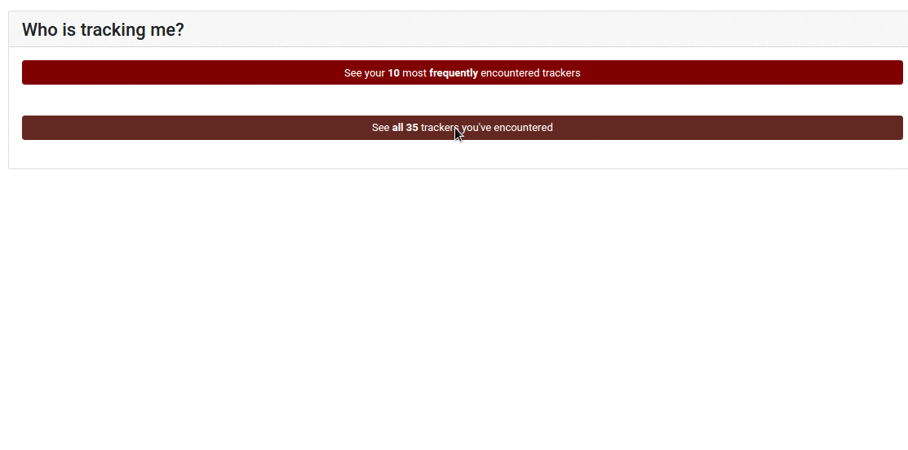

  

# Tracking Transparency

  
  
  
  

A browser extension to provide transparency about online tracking and the inferences companies make about your browsing in order to target advertisments and personalize your web experience.

<!-- TODO: include screenshot -->
<!--  -->

# Table of Contents

- [About](#about)
- [Running](#running)
- [License](#license)
- [Links](#links)

# About

A browser extension to provide information about online tracking.

# Running

- Install dependencies (run once):
  - OS X: `npm install`
  - Linux/Windows `npm install --no-optional`

- Run webpack: `npm run watch` - this runs Webpack in watch mode and automatically reruns whenever you change any files. Recommended to leave this running in a background terminal.
- Open Chrome and install extension, or run in a temporary Firefox profile by running `npm run firefox`

## Building for Production

Run `npm dist`. This creates a zip file in the `web-ext-artifacts/` folder.

# License

# Links
